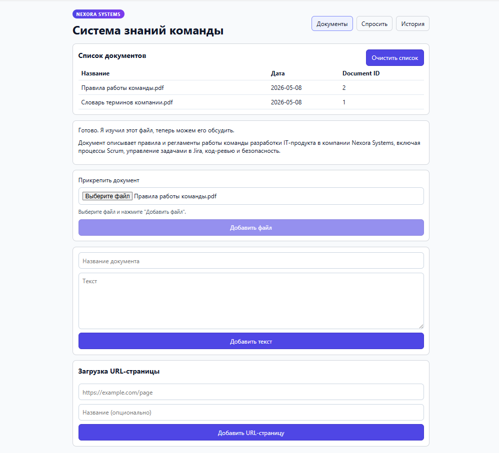
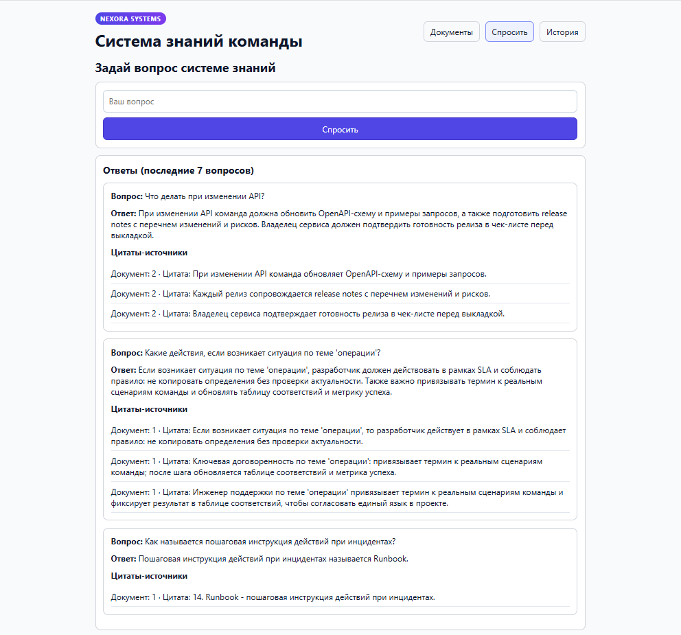
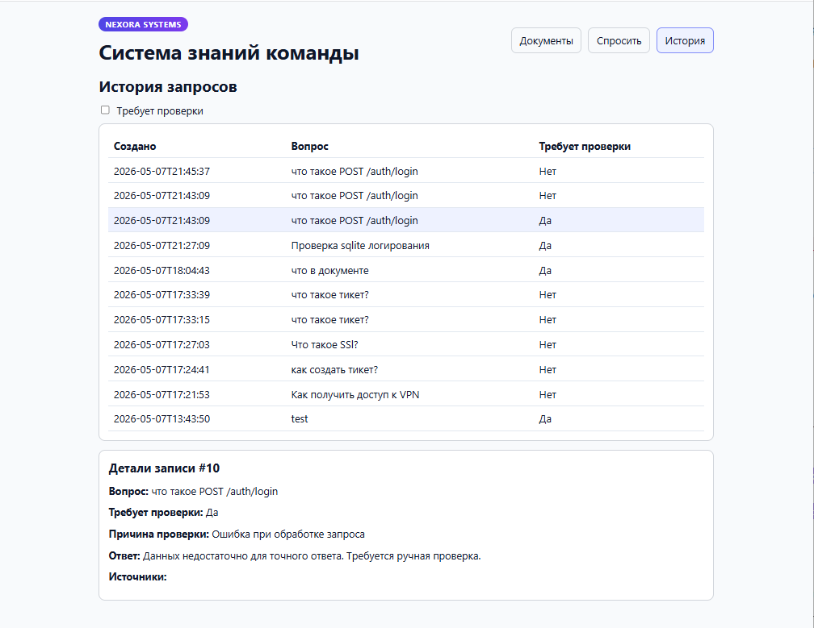
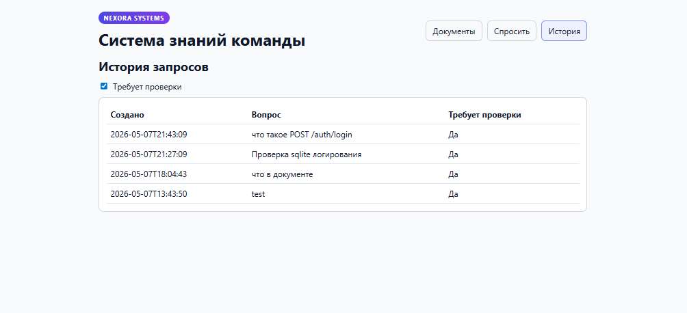

# Система знаний команды

Сервис командной базы знаний: документы индексируются в SQLite + Pinecone, ответы на вопросы формируются через Haystack + OpenAI-compatible API и возвращаются с источниками и флагом `needs_review`.

## Структура проекта
```text
team-knowledge-system/
├── backend/
│   ├── app/
│   │   ├── api/
│   │   ├── core/
│   │   ├── models/
│   │   ├── schemas/
│   │   ├── services/
│   │   ├── utils/
│   │   ├── data/
│   │   │   ├── uploads/
│   │   │   └── processed/
│   │   ├── main.py
│   │   └── dependencies.py
│   ├── tests/
│   │   ├── test_kb.py
│   │   ├── test_ai.py
│   │   ├── test_review.py
│   │   ├── test_pipeline.py
│   │   └── run_kb_eval.py
│   ├── tests_data/
│   │   ├── kb_documents.jsonl
│   │   └── kb_questions.jsonl
│   ├── requirements.txt
│   ├── Dockerfile
│   ├── .env
│   └── .env.example
├── frontend/
├── docker-compose.yml
├── Makefile
└── app.py
```

## Технологии
- Backend: FastAPI, SQLAlchemy, Pydantic
- RAG: Haystack, Pinecone, OpenAI-compatible API
- Document ingestion: Docling
- Frontend: React + Vite
- Хранилище: SQLite (`documents`, `knowledge_chunks`, `qa_runs`, `audit_runs`)
- Инфраструктура: Docker + Docker Compose

## Реализованный функционал
- Загрузка документов в базу знаний:
  - ручной ввод текста (`POST /kb/documents`)
  - загрузка файлов через Docling (`POST /kb/files`)
  - загрузка веб-страниц по URL (`POST /kb/urls`)
- Ingestion pipeline:
  - сохранение документа в SQLite
  - разбиение на чанки
  - генерация embeddings через OpenAI-compatible API
  - запись чанков в Pinecone и keyword-store
- Retrieval pipeline:
  - embedding вопроса
  - поиск релевантных чанков
  - генерация ответа с источниками
  - валидация структуры ответа
  - вычисление `needs_review`
- История и аудит:
  - сохранение QA-записей (`qa_runs`)
  - аудит API-вызовов (`audit_runs`)
  - просмотр аудита через `GET /audit/latest`
- Frontend:
  - страницы `Документы`, `Спросить`, `История`
  - сохранение последних 7 ответов на экране `Спросить` после перезагрузки страницы

## Установка и запуск (DEV)
1. Создайте и активируйте виртуальное окружение:
```powershell
python -m venv .venv
.\.venv\Scripts\Activate.ps1
```

2. Установите backend-зависимости:
```bash
pip install -r backend/requirements.txt
```

3. Создайте env-файл из шаблона:
```bash
copy backend\.env.example backend\.env
```

4. Запустите backend:
```bash
uvicorn app:app --reload
```

5. Запустите frontend:
```bash
cd frontend
npm install
npm run dev
```

### Команды через Makefile
```bash
make dev-backend
make dev-frontend
make test
make test-unit
make test-e2e
```

## Запуск через Docker
```bash
docker compose up --build
```

## Переменные окружения
Полный список: `backend/.env.example`.

Ключевые переменные:
- `OPENAI_API_KEY` — ключ OpenAI/совместимого провайдера
- `OPENAI_BASE_URL` — base URL провайдера (например `https://api.proxyapi.ru/openai/v1`)
- `OPENAI_MODEL` — модель чата
- `OPENAI_EMBEDDING_MODEL` — модель эмбеддингов
- `PINECONE_API_KEY` — ключ Pinecone
- `PINECONE_INDEX_NAME` — имя индекса Pinecone
- `DATABASE_URL` — путь к SQLite (по умолчанию `sqlite:///./team_memory.db`)
- `VECTOR_TOP_K`, `KEYWORD_TOP_K`, `HYBRID_TOP_K` — параметры retrieval

## Примеры API (curl)
```bash
curl -X POST http://127.0.0.1:8000/kb/documents \
  -H "Content-Type: application/json" \
  -d "{\"title\":\"Памятка команды\",\"text\":\"Код проходит code review перед слиянием в main.\"}"

curl -X POST http://127.0.0.1:8000/kb/ask \
  -H "Content-Type: application/json" \
  -d "{\"question\":\"Что обязательно перед слиянием в main?\"}"

curl -X GET http://127.0.0.1:8000/audit/latest
```

## Где лежит база данных и как посмотреть аудит
- Локальная SQLite база: `team_memory.db` (в корне проекта).
- Таблицы: `documents`, `knowledge_chunks`, `qa_runs`, `audit_runs`.
- Аудит через API:
```bash
curl -X GET http://127.0.0.1:8000/audit/latest
```
- Пример SQL-проверки через Python:
```bash
python -c "import sqlite3; c=sqlite3.connect('team_memory.db'); print(c.execute('select id,action,status,duration_ms from audit_runs order by id desc limit 10').fetchall())"
```

## Тесты
- Unit/integration:
```bash
pytest backend/tests -q
```
- E2E-проверка набора вопросов:
```bash
python -m backend.tests.run_kb_eval
```

## Как воспроизвести ручную проверку (`needs_review=true`)
1. Убедитесь, что backend запущен.
2. Запустите:
```bash
python -m backend.tests.run_kb_eval
```
3. В `backend/tests_data/kb_questions.jsonl` есть вопросы без опоры на знания (например про бюджет), для них ожидается `expected_needs_review=true`.
4. Ручной API-тест:
```bash
curl -X POST http://127.0.0.1:8000/kb/ask \
  -H "Content-Type: application/json" \
  -d "{\"question\":\"Какой бюджет проекта?\"}"
```
Ожидаемый результат: `needs_review: true`.

## Скриншоты ключевых экранов
Добавьте изображения в папку `screenshots` и используйте ссылки:







